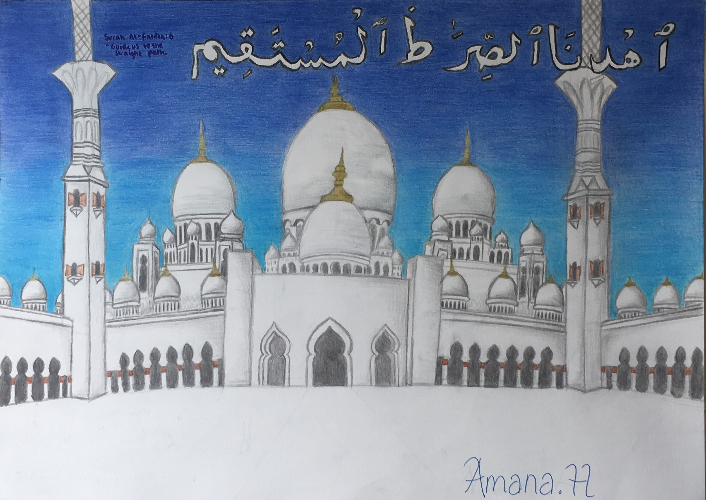

# Architectural theme:

*This was drawn at the start of lockdown. It is a drawing of the Sheikh Zayed Mosque in Abu Dhabi - the capital of the United Arab Emirates. The marble white tiles of the mosque boldly contrast with the bright blue sky which is one of its most beautfiul features.*
- **Date:** Mar 2020
- **Size:** A3
- **Style:** Drawn and coloured with pencils

