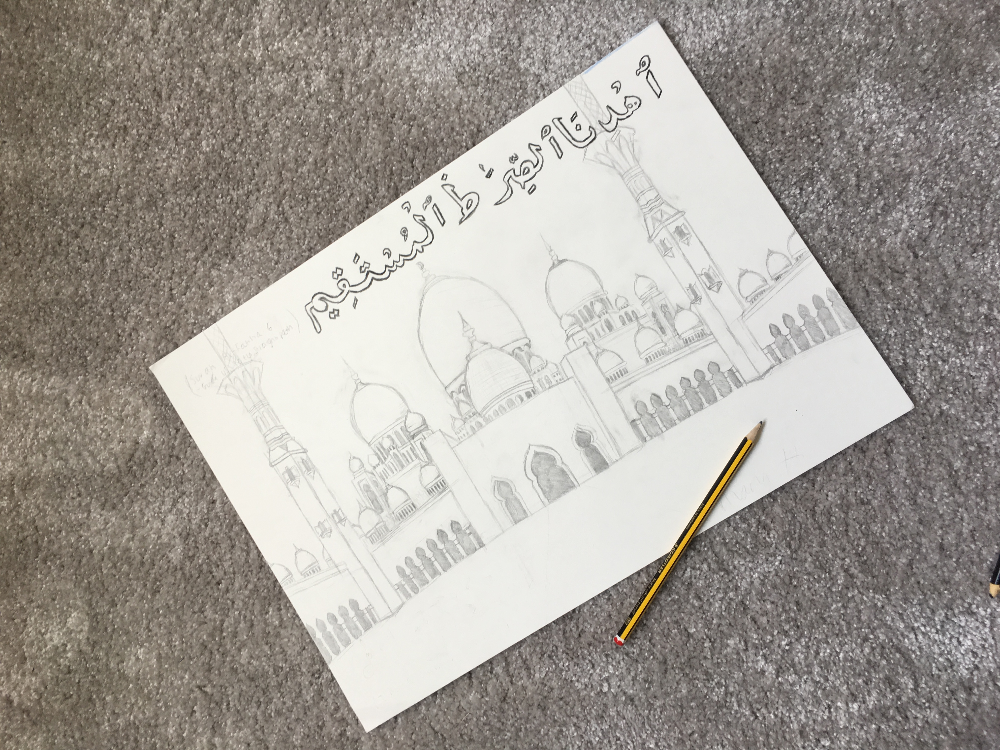
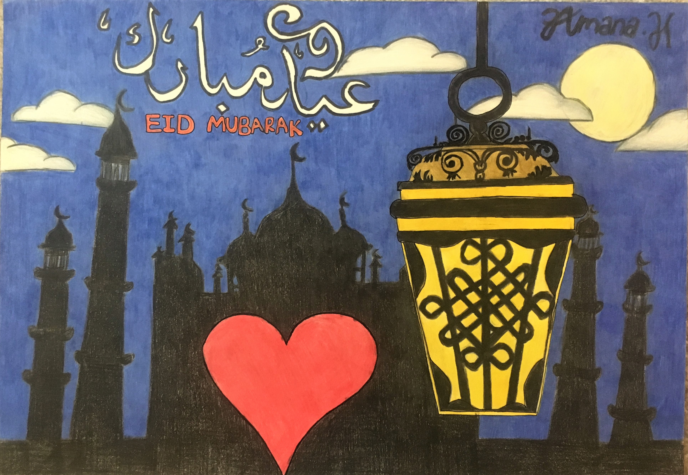

# Architecture:

*This was drawn at the start of lockdown. It is a drawing of the Sheikh Zayed Mosque in Abu Dhabi - the capital of the United Arab Emirates. The marble white tiles of the mosque boldly contrast with the bright blue sky which is one of its most beautfiul features.*
- **Date:** Mar 2020
- **Size:** A3
- **Style:** Drawn and coloured with pencils
-**Time spent creating:** I did this over around 2 weeks spending a few hours each day with a few breaks. (Colouring the sky took a long time!)

*This shows a zoomed up image of my drawing, showing the technique i used to create it. Something i found quite hard was colouring the actual building, however i eventually was able to shade it using grey and black colours to create the perception that the sun is on the left creating the shadow on the right.*

 
*This is what my drawing looked like at the end of day 1 of drawing. It didn't look like what i wanted the end product to look like- but it never does initially!*

*This last image shows the finished drawing in black and white before adding any colour. I was quite scared to add colour, as once i added it i wouldn't be able to go back and it might have ruined it, but fortunately i think it worked out.*

