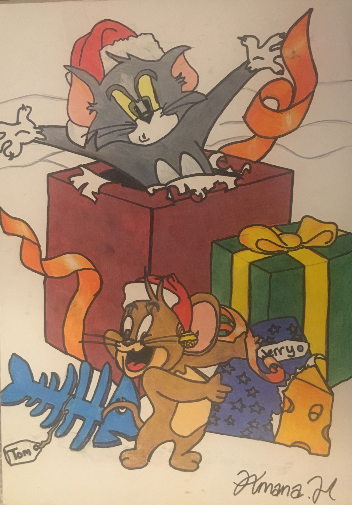
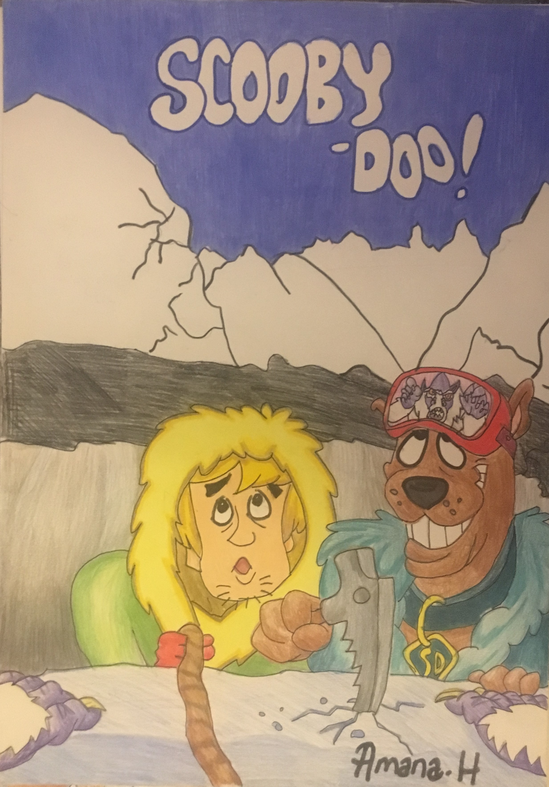

# Architectural theme:

*This was drawn at the start of lockdown. It is a drawing of the Sheikh Zayed Mosque in Abu Dhabi - the capital of the United Arab Emirates. The marble white tiles of the mosque boldly contrast with the bright blue sky which is one of its most beautfiul features.*
- **Date:** Mar 2020
- **Size:** A3
- **Style:** Drawn and coloured with pencils

# Cartoons:

  
*This piece was one of the first drawings i created which i shared publicly (via Instagram). It received lots of positive feedback so i decided to create more. I was inspired to do this by a DVD cover of a Tom and Jerry film haha!*
- **Date:** around 2017
- **Size:** A3
- **Style:** Drawn and coloured with pencils 

*Quite a few of my pieces started off as cartoons which i was most confident in drawing, which is why there are many cartoons here. Scooby Doo was one of my favourite cartoons so i decided to draw it!*
- **Date:** around 2018
- **Size:** A3
- **Style:** Drawn and coloured with pencils

