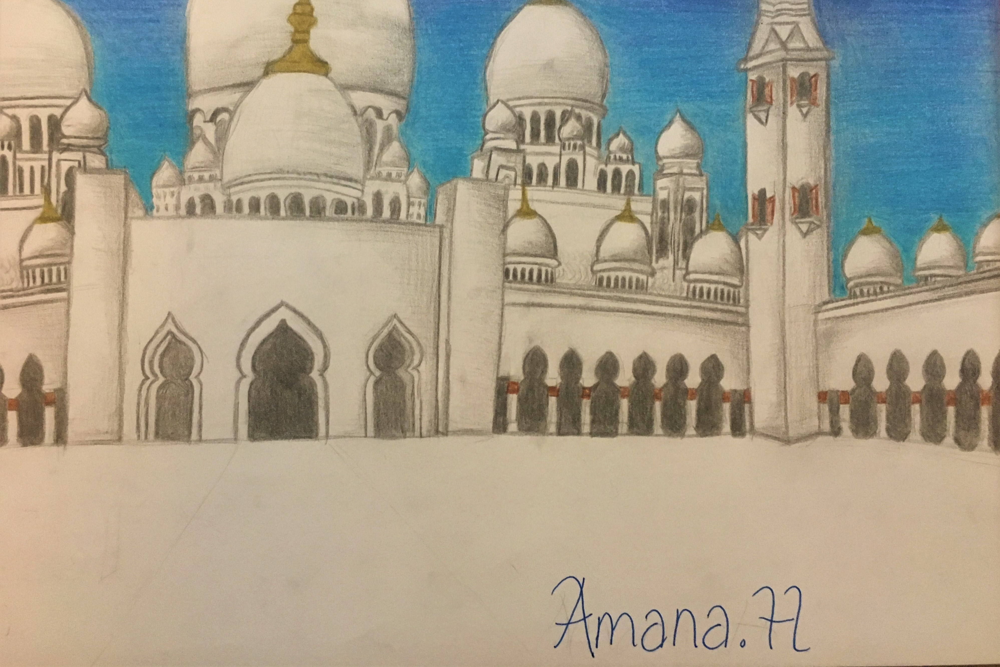
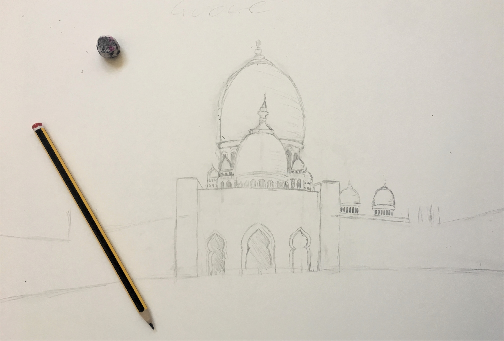
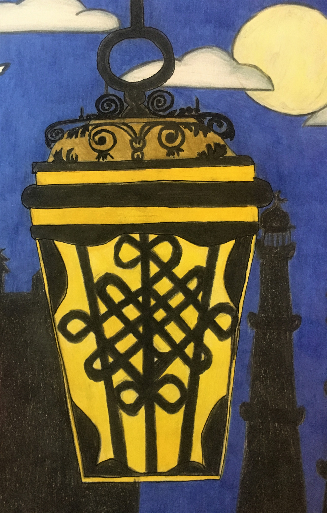

# -----------Architecture:------------

# Drawing 1

*This was drawn at the start of lockdown. It is a drawing of the Sheikh Zayed Mosque in Abu Dhabi - the capital of the United Arab Emirates. The marble white tiles of the mosque boldly contrast with the bright blue sky which is one of its most beautfiul features.*
- **Date:** Mar 2020
- **Size:** A3
- **Style:** Drawn and coloured with pencils
- **Time spent creating:** I did this over around 2 weeks spending a few hours each day with a few breaks. (Colouring the sky took a long time!)

*Here's a zoom in so you can see how i shaded (and some of my bad colouring haha) Something i found quite hard was colouring the actual building, however i eventually was able to shade it using grey and black colours to create the perception that the sun is on the left creating the shadow on the right.* 

 

*The result of day 1 of drawing. It didn't look like what i wanted the end product to look like- but it never does initially! You can see theres been a lot of reshaping and rubbing out mistakes, when drawing i tend to use maths in my head to calculate the proportions of the page different shapes take up (its very helpful)*

*This last image shows the finished drawing in black and white before adding any colour. I was quite scared to add colour, as once i added it i wouldn't be able to go back and it might have ruined it, but fortunately i think it worked out.*

# -----------------------------------------

# Drawing 2:

*Heres is another drawing i did. It is one of the first A3 drawings i made, which i created in one of the school summer holidays when i had lots of spare time. My favourite part is the lantern design which acts as a light in the dark image.As you can see this isn't my best drawing - the colouring isn't the best and more tiem could have been spent drawing more intricate details - but practise makes perfect!*
- **Date:** Summer 2017
- **Size:** A3
- **Style:** Drawn and coloured in pencil

*And here's a zoomed in image of the lantern!- yes the colours seem really dark but i really did colour using normal pencils (but pressed really hard to make it darker and vibrant)*

