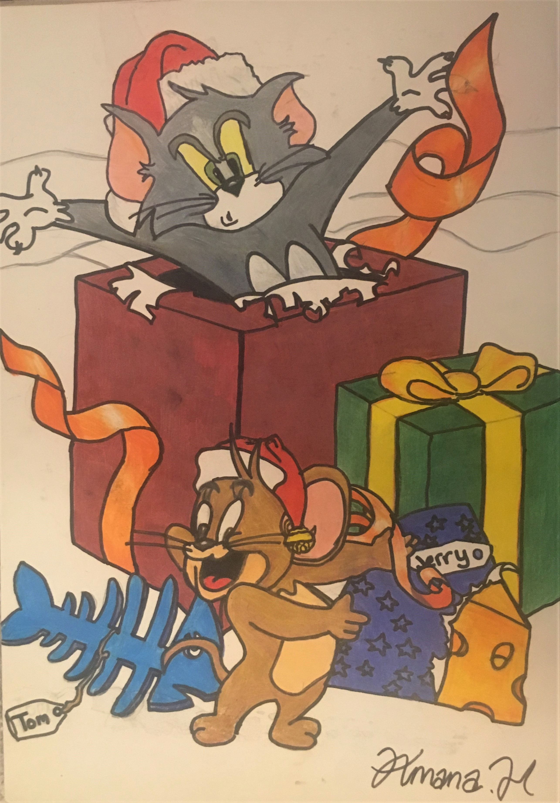
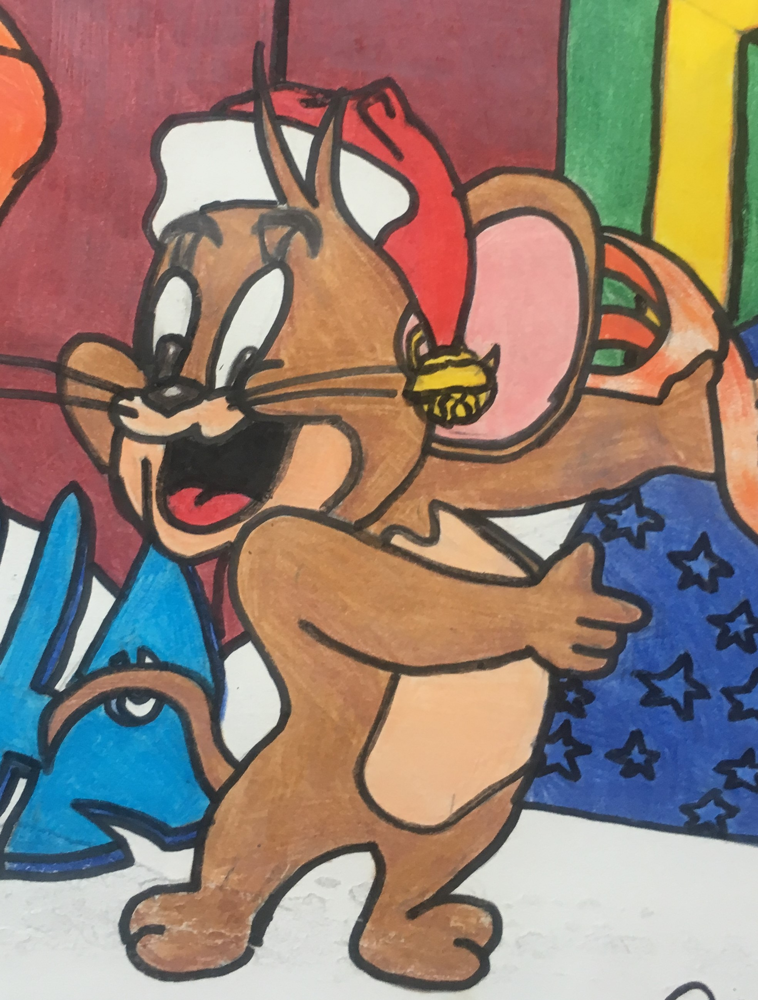
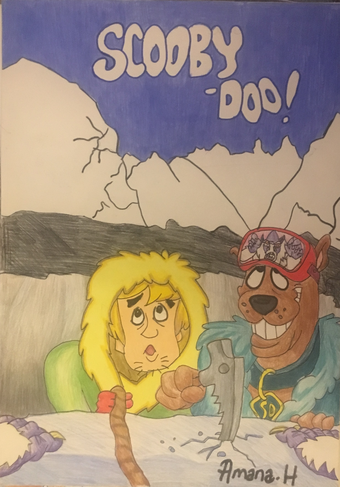
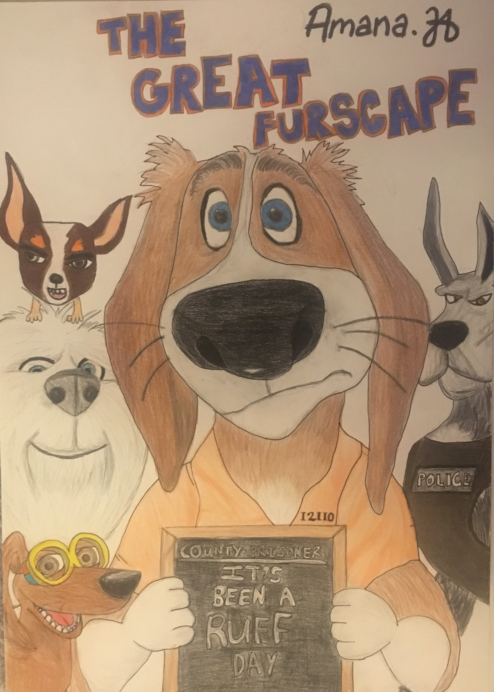
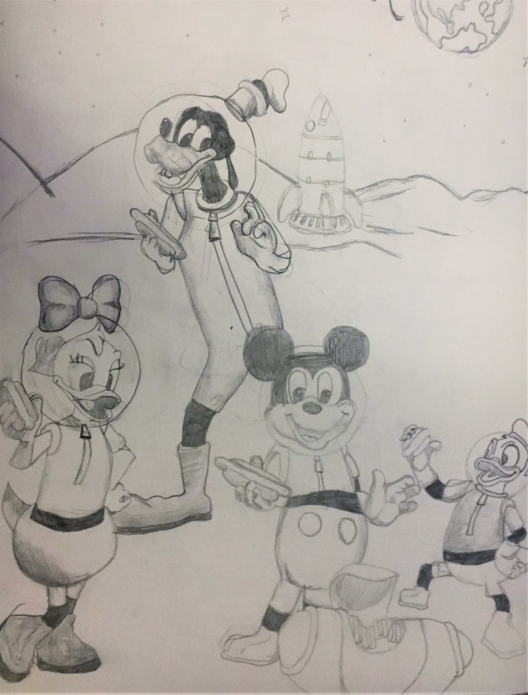

# ------------Cartoons:------------

# Drawing 3:

*Here's a drawing of Tom jumping out a present to surprise/scare Jerry in the Christmas season.*

*This piece was one of the first drawings i created which i shared publicly (via Instagram). It received lots of positive feedback so i decided to create more. I was inspired to do this by a DVD cover of a Tom and Jerry film haha!- beside the whole drawing you can see a zoom in of smiley Jerry! :)*
- **Date:** around 2017
- **Size:** A3
- **Style:** HB pencil,Crayola colouring pencils, and black felt tip pen (to create the bold cartoon effect)
- **Time spent creating:** around 7-10 hours over a couple of weeks

-----------------------------
# Drawing 4:

*Quite a few of my pieces started off as cartoons which i was most confident in drawing, which is why there are many cartoons here.In this drawing i tried to show the scene where Scooby Doo and Shaggy were being chased by a monster (whose reflection you can see in Scooby's goggles). Scooby Doo was one of my favourite cartoons so i decided to draw it! However, i think im now more interested in drawing landscapes/buildings.*
- **Date:** around 2018
- **Size:** A3
- **Style:** HB pencil and Crayola colouring pencils
- **Time spent creating:** a few hours over a few days
-----------------------------
# Drawing 5:

*This was also inspired by a DVD cover.It shows a group of dogs with one who gets stuck in prison, whilst theres another dog 'officer' overlooking them. When i was bored in the summer holidays i would just draw random cartoons from movie covers, and this is another example of that.*
- **Date:** around 2018
- **Size:** A3
- **Style:** HB pencil and Crayola colouring pencils
- **Time spent creating:** around 5 hours
-----------------------------
# Drawing 6:

*I didn't really complete this piece, as i did it for fun, but since it was part of the collection i've uploaded it*
- **Date:** 2017
- **Size:** A3
- **Style:** HB pencil 
- **Time spent creating:** can't remember

