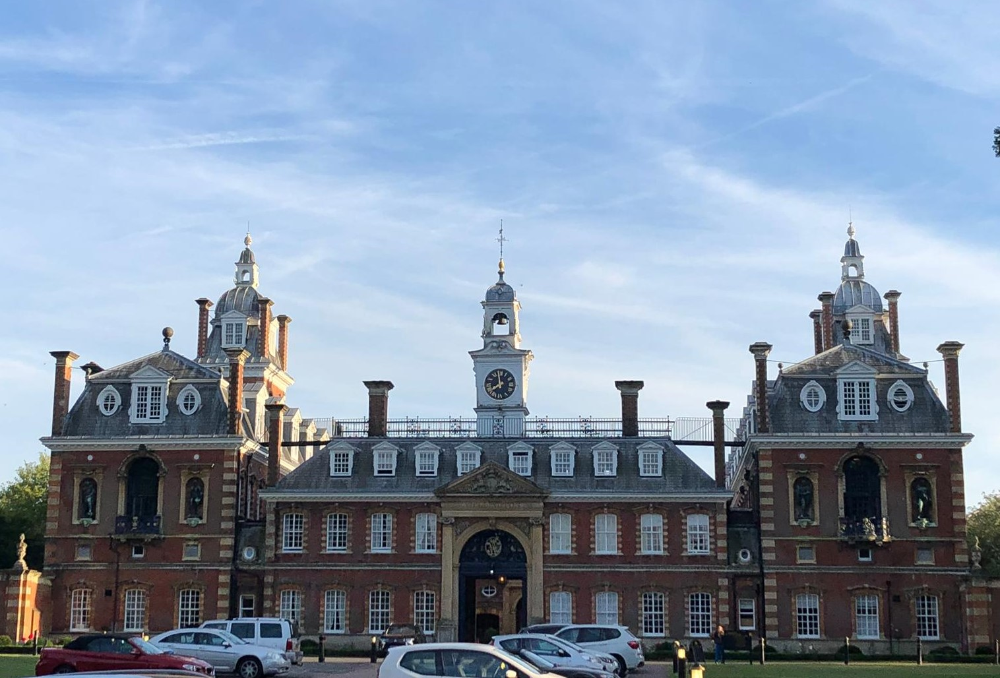

This photograph is part of Wellington College located in Crowthorne,UK. During a McKinsey residential I stayed here. 
**Date taken:** Early July 2019

This is the front of Wellington College

This is when i got the opportunity to go to the 42nd floor of leadenhall, the view was amazing!
**Date taken:** October 2019

This was during a boat party, and again the view was so good!
**Date taken:** December 2019

This is St Pauls Cathedral,from the window of a car. It was really quiet with not many people, so a perfect opportunity to take a photo.
**Date taken:** June 2019