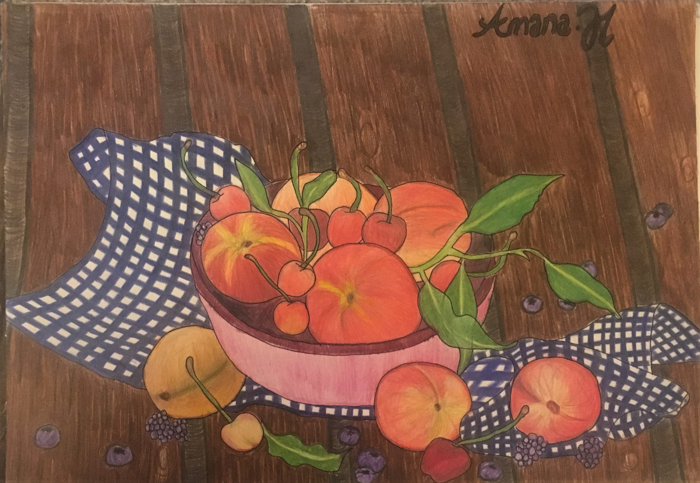
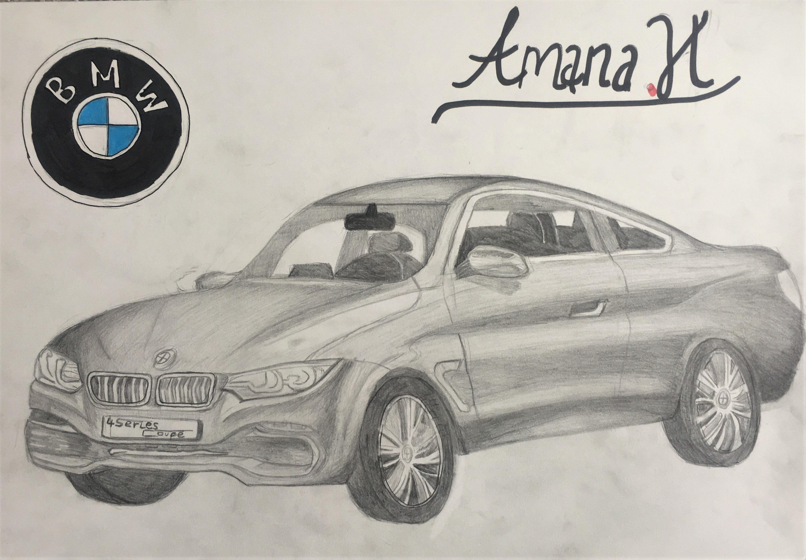

# Random other pieces:

# Drawing 6:

*After my initial cartoon drawings i decided to switch it up and decide something more real- i chose a bowl of fruits. Surprisingly, this has turned out as one of my favourite pieces, by using different shades for the objects i managed to add a 3D effect making them look somewhat real.*
- **Date:** July 2017 
- **Size:** A3
- **Style:** Drawn and coloured with pencils
- **Time spent creating:** To be completely honest, i can't remember but definitely was done over a few days.

# Drawing 7:

*Created this piece in my art lessons where we were told to draw some scribbles on our page with eyes closed and then colour it in - somehow i really looked the abstract and random look.*
- **Date:** Very old, i actually did it in year 9 Art in 2013 but really liked the look of it so kept it.
- **Size:** A3
- **Style:** Drawn and coloured with crayons
- **Time spent creating:** a few hours

# Drawing 8:

*This was inspired by my brother. He used to draw cars very well so i wanted to give it a go myself- turns out cars are REALLLY hard to draw.*
- **Date:** Mar 2020
- **Size:** A3
- **Style:** HB pencil and eraser
- **Time spent creating:** a few hours over a few days (it was a while back so i can't remember precisely)

